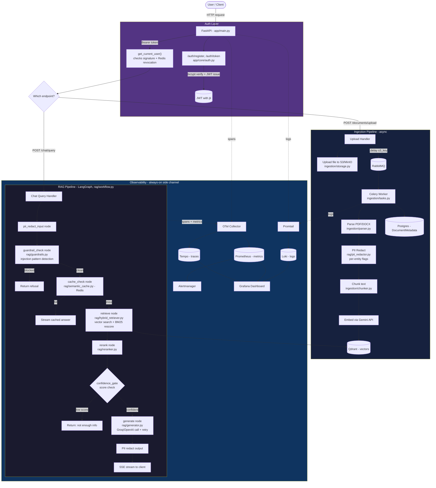

```mermaid
flowchart TD
    User([User / Client]) -->|HTTP request| API[FastAPI - app/main.py]

    subgraph AUTH["Auth Layer"]
        API --> Login["/auth/register, /auth/token<br/>app/core/auth.py"]
        Login -->|bcrypt verify + JWT issue| Token[(JWT with jti)]
        API -->|Bearer token| Verify["get_current_user()<br/>checks signature + Redis revocation"]
    end

    Verify --> Route{Which endpoint?}

    Route -->|POST /documents/upload| Upload[Upload Handler]
    Route -->|POST /chat/query| Query[Chat Query Handler]

    subgraph INGEST["Ingestion Pipeline - async"]
        Upload --> S3[Upload file to S3/MinIO<br/>ingestion/storage.py]
        Upload -->|.delay s3_key| Queue[(RabbitMQ)]
        Queue --> Worker[Celery Worker<br/>ingestion/tasks.py]
        Worker --> Parse["Parse PDF/DOCX<br/>ingestion/parser.py"]
        Parse --> PIIRedact1["PII Redact<br/>rag/pii_redactor.py<br/>per-entity flags"]
        PIIRedact1 --> Chunk["Chunk text<br/>ingestion/chunker.py"]
        Chunk --> Embed["Embed via Gemini API"]
        Embed --> QdrantWrite[(Qdrant - vectors)]
        Worker --> PGWrite[(Postgres - DocumentMetadata)]
    end

    subgraph RAG["RAG Pipeline - LangGraph, rag/workflow.py"]
        Query --> InputRedact["pii_redact_input node"]
        InputRedact --> Guard["guardrail_check node<br/>rag/guardrails.py<br/>injection pattern detection"]
        Guard -->|blocked| Refuse1[Return refusal]
        Guard -->|clean| CacheCheck["cache_check node<br/>rag/semantic_cache.py - Redis"]
        CacheCheck -->|hit| StreamCached[Stream cached answer]
        CacheCheck -->|miss| Retrieve["retrieve node<br/>rag/hybrid_retriever.py<br/>vector search + BM25 rescore"]
        Retrieve --> QdrantWrite
        Retrieve --> Rerank["rerank node<br/>rag/reranker.py"]
        Rerank --> Confidence{"confidence_gate<br/>score check"}
        Confidence -->|low score| Refuse2["Return: not enough info"]
        Confidence -->|confident| Generate["generate node<br/>rag/generator.py<br/>Groq/OpenAI call + retry"]
        Generate --> OutputRedact["PII redact output"]
        OutputRedact --> Stream[SSE stream to client]
    end

    subgraph OBS["Observability - always-on side channel"]
        API -.->|spans| OTel[OTel Collector]
        RAG -.->|spans + metrics| OTel
        OTel --> Tempo[(Tempo - traces)]
        OTel --> Prom[(Prometheus - metrics)]
        Worker -.->|logs| Promtail[Promtail]
        API -.->|logs| Promtail
        Promtail --> Loki[(Loki - logs)]
        Prom --> Alert[Alertmanager]
        Tempo --> Grafana[Grafana Dashboard]
        Prom --> Grafana
        Loki --> Grafana
    end

    style RAG fill:#1a1a2e,color:#fff
    style INGEST fill:#16213e,color:#fff
    style OBS fill:#0f3460,color:#fff
    style AUTH fill:#533483,color:#fff
```